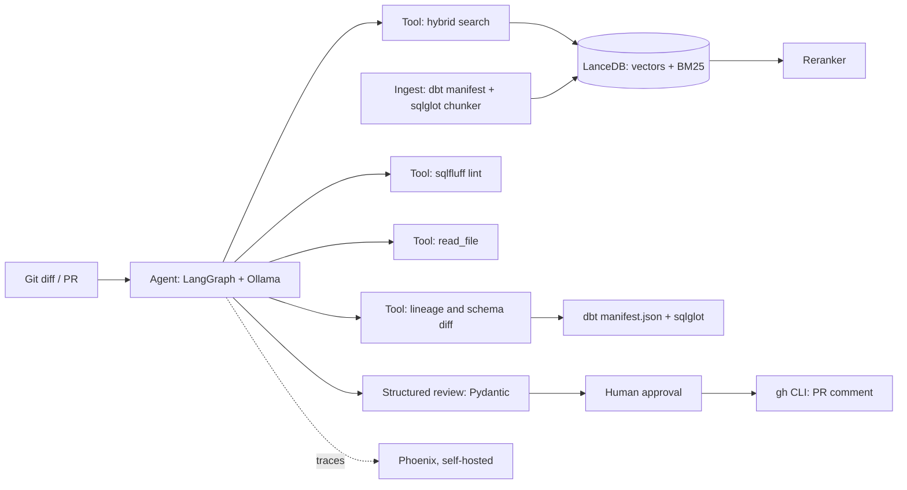

# Architecture

```mermaid
flowchart LR
  A[Git diff / PR] --> B[Agent: LangGraph + Ollama]
  B --> C[Tool: hybrid search]
  B --> D[Tool: lineage and schema diff]
  B --> E[Tool: sqlfluff lint]
  B --> F[Tool: read_file]
  C --> G[(LanceDB: vectors + BM25)]
  G --> H[Reranker]
  I[Ingest: dbt manifest + sqlglot chunker] --> G
  D --> J[dbt manifest.json + sqlglot]
  B --> K[Structured review: Pydantic]
  K --> L[Human approval] --> M[gh CLI: PR comment]
  B -.traces.-> N[Phoenix, self-hosted]
```

Principle: deterministic tools compute lineage; the LLM interprets and explains.
